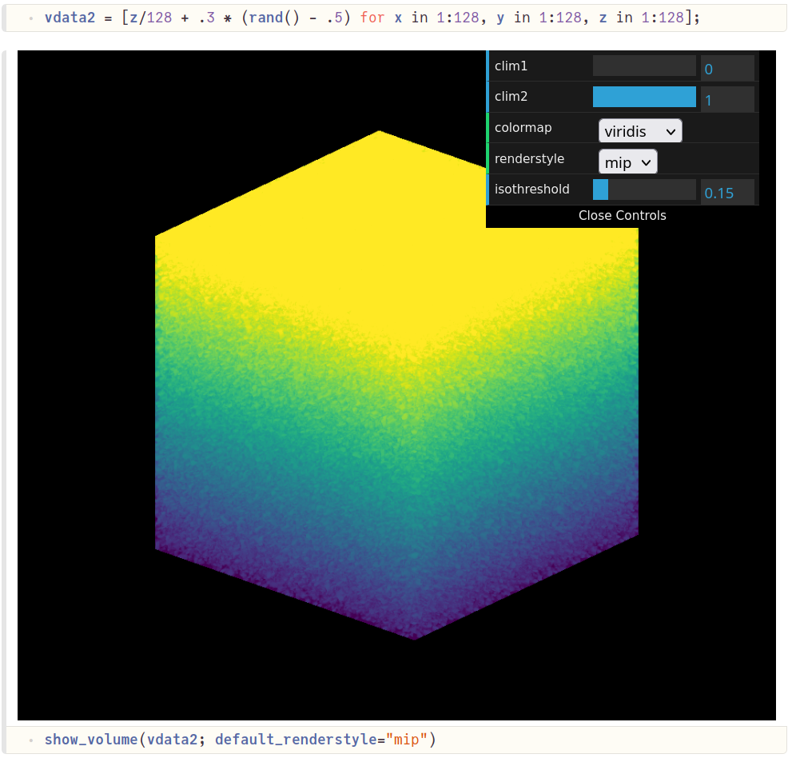
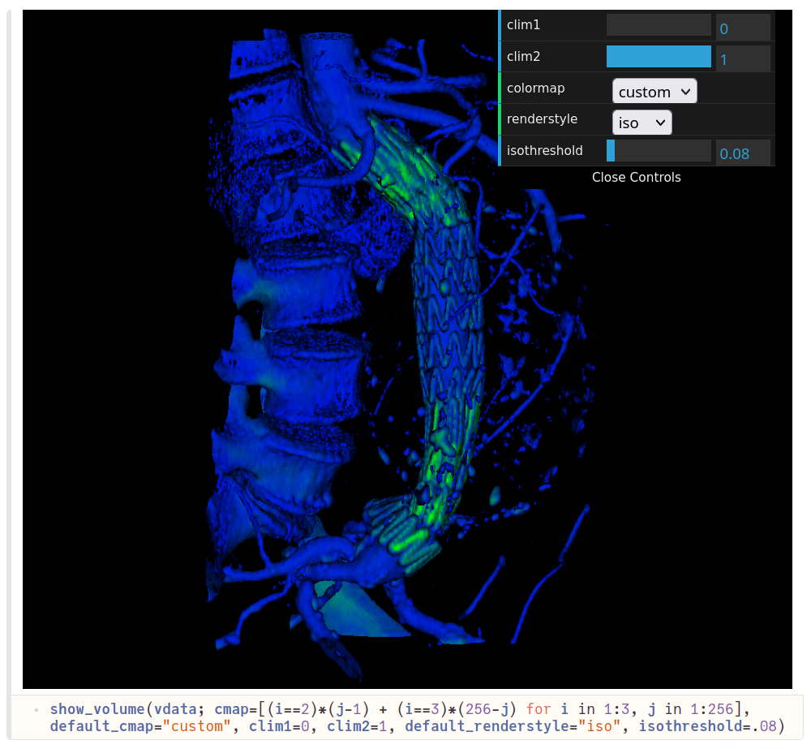

# JSVolume.jl

A [three.js](https://github.com/mrdoob/three.js) based 3D volume visualizer for Pluto notebooks.

MRI exam taken from [webgl2_materials_texture3d](https://zalo.github.io/three.js/examples/webgl2_materials_texture3d.html).

## Screenshots

